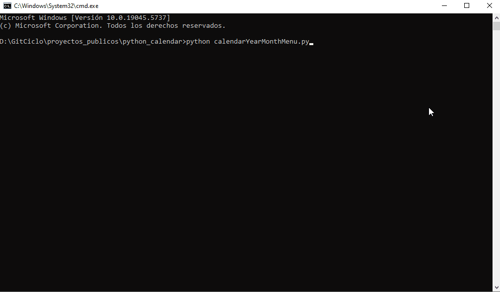
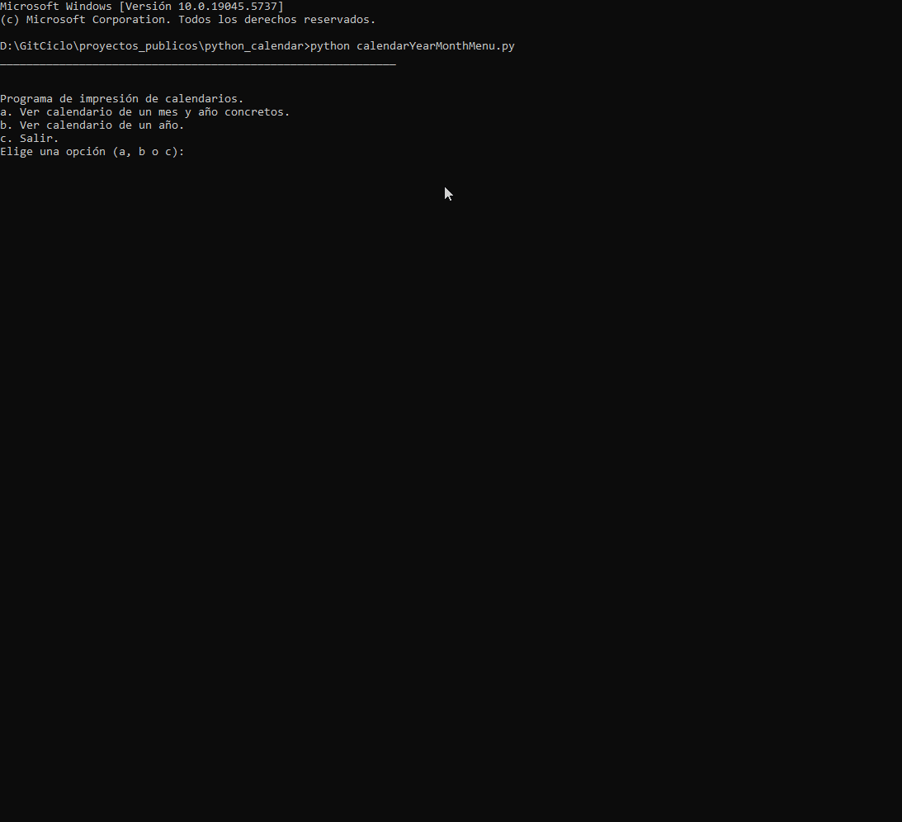

🗓️ # Calendario en Python | Python Calendar Project
🇪🇸 ### Descripción

Este proyecto contiene tres scripts en Python que generan calendarios usando matrices. Incluyen:

    📅 **Calendario mensual**: imprime el calendario de un mes específico.

    📅 **Calendario anual**: muestra todos los meses de un año.

    📋 **Calendario con menú interactivo**: permite al usuario elegir entre ver un mes, un año completo o salir, con validación de entradas.

🇬🇧 ### Description

This project includes three Python scripts that generate calendars using matrix-based logic. It features:

    📅 **Monthly Calendar**: prints the calendar for a specific month and year.

    📅 **Yearly Calendar**: displays the full calendar of a given year.

    📋 **Interactive Menu Calendar**: lets the user choose between viewing a month, a full year, or exiting, with input validation.

## 🎥 Demo Month Calendar

## 🎥 Demo Year Calendar

No external libraries or AI help were used.
